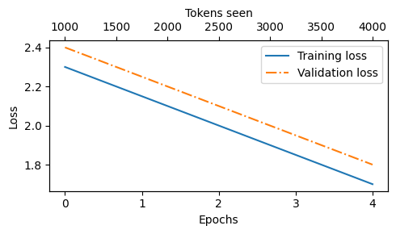
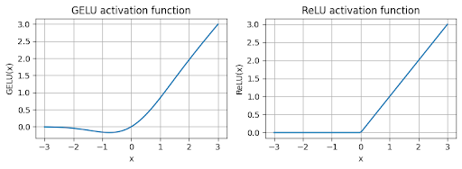
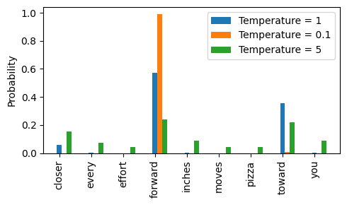
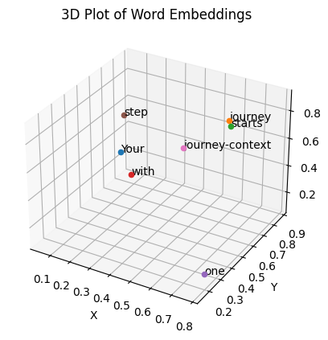
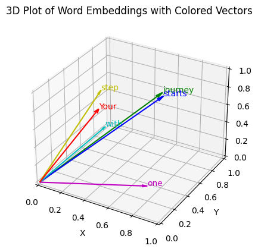

## Foundational Large Language Model: Transformer Pipeline

This repository contains a **foundational implementation of a Large Language Model (LLM)**, combining principles from GPT and other LLM architectures.
It demonstrates a full pipeline from tokenization to model training, text generation, evaluation, and visualization, implemented from scratch.

This project is based on the book: 
Sebastian Raschka - *Build a Large Language Model (From Scratch)*, Manning (2024). 
The code demonstrates foundational LLM concepts and training pipeline for educational purposes.

---

## Key Features

### 1. Foundational LLM Mechanics
- Implements the core Transformer building blocks for large language models:
  - **Token embeddings** and **positional embeddings**
  - **Multi-head self-attention** mechanism
  - **Feed-forward layers** within Transformer blocks
  - **Layer normalization** and residual connections
- Demonstrates essential LLM operations:
  - Attention computation
  - Forward pass propagation
  - Next-token prediction
- Designed as a **foundational framework** before adding higher-level architectures like GPT

### 2. GPT Model Class (Built on top of foundational LLM)
- Uses the Transformer building blocks to implement a **GPT-style model**:
  - Sequential stack of Transformer blocks
  - Linear output projection for next-token prediction
  - Supports variable batch sizes and sequence lengths
- Illustrates how **core LLM components integrate into a GPT-style architecture**

### 3. Text Tokenization
- Uses **GPT-2 tokenizer** (`tiktoken`) for converting text to token IDs
- Utility functions:
  - `text_to_token_ids(text, tokenizer)` → converts text to token tensors
  - `token_ids_to_text(token_ids, tokenizer)` → converts token tensors back to text

### 4. Text Generation
- Greedy decoding via `generate_text_simple`
  - Sequential token generation by selecting the most probable next token
- Supports advanced decoding strategies:
  - Temperature scaling
  - Probabilistic sampling with `torch.multinomial`
  - Top-k sampling for variety in generated text

### 5. Loss Calculation and Evaluation
- Cross-entropy loss between predicted logits and target token sequences
- Computes **perplexity** for interpretable performance metrics
- Evaluation utilities:
  - `calc_loss_batch` → batch-level loss
  - `calc_loss_loader` → average loss over a DataLoader
  - `evaluate_model` → training & validation loss monitoring

### 6. Dataset Preparation
- Prepares text into overlapping sequences using `GPTDatasetV1`
- Supports:
  - Sliding window text chunking
  - Automatic input-target pair creation for next-token prediction
- Compatible with PyTorch `DataLoader` for batch training

### 7. Training Loop
- `train_model_simple` function:
  - Standard LLM training loop using **AdamW optimizer**
  - Tracks training and validation loss across epochs
  - Generates text samples at the end of each epoch for qualitative evaluation
- Includes GPU/CPU device management and reproducibility utilities

### 8. Visualization
- Plots training and validation loss curves
- Dual-axis plots for epochs vs. tokens seen

### 9. Quick Testing
- Forward-pass test for validation without full training
- Ideal for low-resource environments or initial sanity checks

---

##  Project Visualizations

To ensure the model was converging correctly, I tracked several key metrics. The visualizations below highlight the training progress and the mathematical foundations of the GPT architecture.

### Model Convergence
By placing the primary metric in a centered box, we maintain a consistent visual language across the README.

| **Training & Validation Loss** | 
| :---: | 
|  | 
| *Cross-entropy loss tracking across 10 Epochs.* |

---

###  Technical Mechanics
These plots compare the internal building blocks of the Transformer. Using a side-by-side grid keeps the comparison sharp.

| **GELU vs ReLU Comparison** | **Temperature Scaling Impact** |
| :---: | :---: |
|  |  |
| *Smoothness of GPT activation layers.* | *Distribution shifts for next-token prediction.* |

---

###  Embedding Space Visualization
These 3D plots represent the high-dimensional vector space where the model organizes token relationships.

| **Vector Projections (A)** | **Vector Projections (B)** |
| :---: | :---: |
|  |  |
| *3D spatial organization of token embeddings.* | *Relationship clusters in the latent space.* |

### Installation

Install required dependencies:

```bash
pip install torch tiktoken matplotlib
```


### Usage

Clone the repository:

```bash
git clone <repo-url>
cd <repo-folder>
```

Load data and initialize the model:

```bash
from model import GPTModel
import tiktoken, torch

tokenizer = tiktoken.get_encoding("gpt2")
model = GPTModel(
    vocab_size=len(tokenizer),
    block_size=128,  # context length
    n_layer=6,       # number of transformer blocks
    n_head=8,        # number of attention heads
    n_embd=256       # embedding dimension
)
```

Train the Model

```bash
from train import train_model_simple

train_model_simple(
    model=model,
    data="data.txt",
    tokenizer=tokenizer,
    epochs=10,
    batch_size=16,
    lr=3e-4,
    device="cuda"  # or "cpu"
)
```

Quick Forward-Pass Test 

```bash
from utils import text_to_token_ids, token_ids_to_text, generate_text_simple, evaluate_model

input_text = "Once upon a time"
input_ids = text_to_token_ids(input_text, tokenizer)
```

Forward pass example

```bash
output_ids = generate_text_simple(model, input_ids, max_new_tokens=50)
output_text = token_ids_to_text(output_ids, tokenizer)
print(output_text)
```

Evaluate the Model
```bash
loss, perplexity = evaluate_model(model, val_loader)
print(f"Validation Loss: {loss:.4f}, Perplexity: {perplexity:.4f}")
```"# LLM-Foundations-GPT-From-Scratch" 
